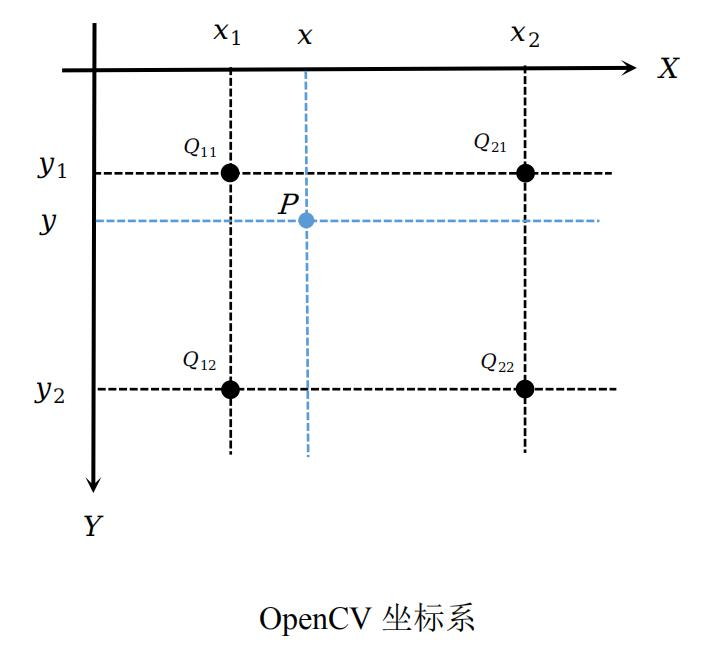

# OpenCV框架与图像插值算法

## 图像缩放

加载图像时经常会遇见要缩放图像的情况。假设原图像是一个像素大小为 $W * H$ 的图片，缩放后图片的像素大小为 $w * h$。此时已知原图像中每个像素点的像素值（像素点对应的像素值坐标为整数）。若已知缩放后有一个像素的像素点为 $(x, y)$，欲得到该像素点的像素值，则需要根据缩放比例去查看其对应的原图像中像素点的像素值，然后将该像素值赋值给缩放后的图片的像素点$(x, y)$。

缩放公式为：
$$
f(X,Y)=f(\frac W w * x, \frac H h * y)
$$
此时缩放后的图片像素点$(x,y)$的像素值就对应着原图像素点$(\frac W w * x, \frac H h * y)$的像素值。然而由于缩放比例的原因，会导致像素点$(\frac W w * x, \frac H h * y)$中的值不是整数，这是需要插值算法来进行处理。常见的插值算法有最近邻插值、双线性插值和三次样条插值。

## 插值算法

### 最近邻插值算法

最近邻插值，是指将目标图像中的点，对应到源图像中后，找到最相邻的整数点（即四舍五入法），作为插值后的输出。

缩放公式为：
$$
f(X,Y)=f([\frac W w * x], [\frac H h * y])
$$
其中$[.]$ 表示四舍五入。

该方法处理简单，然而会缺失精度，造成缩放后的图像灰度上的不连续，在变化地方可能出现明显锯齿状。

### 双线性插值法

双线性插值法取像素点 $P$ 邻近的四个整数像素点的像素值，根据各自坐标所占比例（距离）求解该点的像素值。即对 $X,Y$两个方向分别做线性插值运算。



假设欲得到缩放图像素点对应在原图中的像素点 $P(x,y)$ 的值，在原图中其相邻的四个整数像素点及其像素值为 $Q_{11}(x_1,y_1),\ Q_{12}(x_1, y_2), \ Q_{21}(x_2, y_1), \ Q_{22}(x_2, y_2)$。双线性插值法的计算方式如下：
$$
f(P)≈\frac{y_2-y}{y_2-y_1}\left(\frac{x_2-x}{x_2-x_1}f(Q_{11})+\frac{x-x_1}{x_2-x_1}f(Q_{21})\right)+\\
\qquad \frac{y-y_1}{y_2-y_1}\left(\frac{x_2-x}{x_2-x_1}f(Q_{12})+\frac{x-x_1}{x_2-x_1}f(Q_{22})\right)
$$

其中四个整数像素点为相邻点，即 $x_2-x_1 = 1, \ y_2 - y_1 = 1$ ，令 $u=x-x_1, \ v=y-y_1$ 。则上式可转化为：
$$
f(P)≈
\begin{bmatrix}
1-u & u
\end{bmatrix}
\begin{bmatrix}
f(Q_{11}) & f(Q_{12}) \\ f(Q_{21}) & f(Q_{22})
\end{bmatrix}
\begin{bmatrix}
1-v \\ v
\end{bmatrix}
$$

### 映射方法

#### 向前映射法

向前映射法（或像素移交影射）将一个输入像素映射到四个输出像素之间的位置，其灰度值按插值算法在4个输出像素之间进行分配。通常从原图像坐标计算出目标图像坐标镜像、平移变换使用这种计算方法。

#### 向后映射法

向后映射法（或像素填充算法）是输出像素一次一个地映射回到输入像素中，以便确定其灰度级。如果一个输出像素被映射到四个输入像素之间，则其灰度值由插值决定，向后空间变换是向前变换的逆。通常用于从结果图像的坐标计算原图像的坐标。

- 旋转、拉伸、放缩可以使用
- 解决了漏点的问题，出现了马赛克


## 基于OpenCV的C++实现

### OpenCV读取、显示、保存图片

|          方法           |                             描述                             |
| :---------------------: | :----------------------------------------------------------: |
|    imread(path,mode)    |              path是图片路径,mode是读取的模式。               |
|    imshow(name,img)     | name显示窗口的名称,可以创建多个窗口,img 是imread读取的图片指针 |
|    imwrite(path,img)    |                       类似与imread函数                       |
|        waitkey()        | 键盘绑定函数。参数是毫秒时间，再这个时间内按下任何键就会继续。如果为0，则无限时间的等待一个键击 |
| destroyAllWindows(name) |                  关闭窗口,可以传入窗口名称                   |
| namedWindow(name,mode)  |         创建窗口，可以使用它创建窗口，然后再显示图像         |

读取图片的模式：

| imread方法mode参数 |                   描述                   |
| :----------------: | :--------------------------------------: |
|    IMREAD_COLOR    | 加载彩色图片，不包含alpha通道，可用1代替 |
|  IMREAD_GRAYSCALE  |           灰度模式，可用0代替            |
|  IMREAD_UNCHANGED  |        包含alpha通道，可用-1代替         |

### C++实现

#### OpenCV resize函数实践

函数原型：

```C++
void cv::resize(InputArray src, OutputArray dst, Size dsize, double fx=0, double fy=0, int interpolation=INTER_LINEAR)
    
/**
src : 输入图像
dst : 输出图像
dsize : 输出图像尺寸
fx，fy : x,y方向上的缩放因子
interpolation ： 插值方法
**/
```

resize参数中的五种插值方法：

| interpolation 选项 |                           插值方法                           |
| :----------------: | :----------------------------------------------------------: |
|   INTER_NEAREST    |                          最近邻插值                          |
|    INTER_LINEAR    |                    双线性插值（默认设置）                    |
|     INTER_AREA     | 使用像素区域关系进行重采样。适于图像抽取，缩放图像它与最近邻法类似。 |
|    INTER_CUBIC     |                   4x4像素邻域的双三次插值                    |
|   INTER_LANCZOS4   |                   8x8像素邻域的Lanczos插值                   |

代码实现：

```c++
/**
 * OpenCV 图像缩放
 * **/

#include <opencv2/opencv.hpp>
#include <iostream>

using namespace cv;
using namespace std;

string yuner = "../image/yuner.jpg";

void resizeTest()
{
    Mat img = imread(yuner);
    if (img.empty()){
        cout << "无法读取图像" << endl;
        return;
    }

    int height = img.rows;
    int wight = img.cols;

    // 缩小图像，比例为(0.4, 0.4)
    float alpha = 0.4;
    Size dsize = Size(round(alpha * wight), round(alpha * height));
    Mat shrink;
    // 使用双线性插值
    resize(img, shrink, dsize, 0, 0, InterpolationFlags::INTER_LINEAR);

    // 在缩小图像的基础上，放大图像，比例为(1.5， 1.5)
    float fx = 1.5;
    float fy = 1.5;
    Mat enlarge1, enlarge2;
    resize(shrink, enlarge1, Size(), fx, fy, InterpolationFlags::INTER_NEAREST);
    resize(shrink, enlarge2, Size(), fx, fy, InterpolationFlags::INTER_LINEAR);

    // 显示
    imshow("src", img);
    imshow("shrink", shrink);
    imshow("INTER_NEAREST", enlarge1);
    imshow("INTER_LINEAR", enlarge2);
    waitKey(0);
}

int main()
{
    resizeTest();
    return 0;
}
```

原图：


0.4倍缩小，双线性插值：


1.5倍放大，最近邻插值：


1.5倍放大，双线性插值：


#### 最近邻插值算法及双线性插值算法的C++实现

interpolation.h头文件如下：

```c++
#ifndef CV_INTERPOLATION_H
#define CV_INTERPOLATION_H

#include <opencv2/highgui/highgui.hpp>
#include <iostream>

using namespace std;

namespace vincent
{
    enum Interpolation {
        NEAREST = 0,
        LINEAR = 1,
    };

    // 图像缩放
    void resize(cv::Mat& src, cv::Mat& tar, float fx, float fy, int inter = LINEAR);

    template <typename T>
    class Impl
    {
    public:
        typedef T (*Fun)(cv::Mat&, float, float);

        Impl()
        {
            funs.emplace_back(inter_nearest);
            funs.emplace_back(inter_linear);
        }

        Fun operator [] (int i)
        {
            if (i < funs.size()) return funs[i];
            else throw "out of Interpolation!";
        }

    private:
        vector<Fun> funs;

        Impl& operator = (const Impl& i);
        Impl(const Impl&);

        // 最近邻插值法
        static T inter_nearest(cv::Mat& src, float x, float y);

        // 双线性插值法
        static T inter_linear(cv::Mat& src, float x, float y);
    };

    static Impl<uchar> interpolationCh1;		// 灰度图处理类
    static Impl<cv::Vec3b> interpolationCh3;	// 彩色图处理类
} // namespace vincent

#endif //CV_INTERPOLATION_H
```

interpolation.cpp文件如下：

```c++
#include "interpolation.h"

using namespace vincent;

void vincent::resize(cv::Mat &src, cv::Mat &tar, float fx, float fy, int inter)
{
    // 计算输出图像的尺寸(四舍五入)
    int tar_cols = round(src.cols * fx);
    int tar_rows = round(src.rows * fy);
    // 创建输出图像
    tar = cv::Mat(tar_rows, tar_cols, src.type());

    // 灰度图处理
    if (src.channels() == 1){

        for (int i = 0; i < tar_rows; i++){
            for (int j = 0; j < tar_cols; j++){
                // 坐标计算
                float x = j / fx;
                float y = i / fy;
                tar.at<uchar>(i, j) = interpolationCh1[inter](src, x, y);
            }
        }
    }
    // 彩色图处理
    else {
        for (int i = 0; i < tar_rows; i++){
            for (int j = 0; j < tar_cols; j++){
                // 坐标计算
                float x = j / fx;
                float y = i / fy;
                tar.at<cv::Vec3b>(i, j) = interpolationCh3[inter](src, x, y);
            }
        }
    }
}

template <typename T>
T Impl<T>::inter_nearest(cv::Mat &src, float x, float y)
{
    // 插值计算
    int i = round(y);
    int j = round(x);

    if (i > src.rows - 1) i = src.rows - 1;
    if (j > src.cols - 1) j = src.cols - 1;

    return src.at<T>(i, j);
}

template <typename T>
T Impl<T>::inter_linear(cv::Mat &src, float x, float y)
{
    int i = (int) y, j = (int) x;
    float u = y - i, v = x - j;

    // 边界处理
    if (i >= src.rows - 1 || j >= src.cols - 1)
        return src.at<T>(i, j);

    T Q11 = src.at<T>(i, j);
    T Q12 = src.at<T>(i, j+1);
    T Q21 = src.at<T>(i+1, j);
    T Q22 = src.at<T>(i+1, j+1);

    return ((1-v)*(1-u)*Q11 + (1-v)*u*Q21 + v*(1-u)*Q12 + v*u*Q22);
}
```

使用上述方法可得到两种插值算法将缩小0.4倍后的图片放大1.5倍的结果。

1.5倍放大，最近邻插值：


1.5倍放大，双线性插值：

