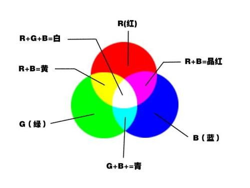
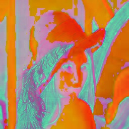
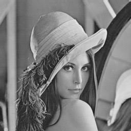

# 彩色空间互转

图像彩色空间互转在图像处理中应用非常广泛，而且很多算法只对灰度图有效；另外，相比RGB，其他颜色空间(比如HSV、HSI)更具可分离性和可操作性，所以很多图像算法需要将图像从RGB转为其他颜色空间，所以图像彩色互转是十分重要和关键的。

## RGB与灰度图

RGB（红绿蓝）是依据人眼识别的颜色定义出的空间，可表示大部分颜色。但在科学研究一般不采用RGB颜色空间，因为它的细节难以进行数字化的调整。它将色调，亮度，饱和度三个量放在一起表示，很难分开。它是最通用的面向硬件的彩色模型。RGB 颜色空间适合于显示系统，却并不适合于图像处理。

RGB颜色空间基于颜色的加法混色原理，从黑色不断叠加Red，Green，Blue的颜色，最终可以得到白色。如下图：



将R、G、B三个通道作为笛卡尔坐标系中的X、Y、Z轴，就得到了一种对于颜色的空间描述，如下图：


RGB彩色图像中，一种彩色由R（红色），G（绿色），B（蓝色）三原色按比例混合而成。图像基本单元是一个像素，一个像素需要3块表示，分别代表R，G，B，如果8位表示一个颜色，就由0-255区分不同亮度的某种原色。灰度图像是用不同饱和度的黑色来表示每个图像点，比如用8位 0-255数字表示“灰色”程度，每个像素点只需要一个灰度值，8位即可。

对于RGB彩色图转灰度图，有一个很著名的心理学公式：
$$
Gray = R * 0.299 + G * 0.587 + B * 0.114
$$

根据这个公式，依次读取每个像素点的R，G，B值，进行计算灰度值（转换为整型数），将灰度值赋值给新图像的相应位置，所有像素点遍历一遍后完成转换。**可以通过将浮点数运算转化为整数运算，整数运算转换为位操作进行优化**。方法如下：
$$
Grey = (R*306 + G*601 + B*117) >> 10 \\
Grey = (R*612 + G*1202 + B*234) >> 11 \\
Grey = (R*1224 + G*2405 + B*467) >> 12 \\
Grey= (R*2449 + G*4809 + B*934) >> 13 \\
Grey= (R*4898 + G*9618 + B*1868) >> 14 \\
Grey = (R*9797 + G*19235 + B*3736) >> 15 \\
Grey = (R*19595 + G*38469 + B*7472) >> 16 \\ 
Grey = (R*39190 + G*76939 + B*14943) >> 17 \\ 
Grey = (R*78381 + G*153878 + B*29885) >> 18 \\
Grey =(R*156762 + G*307757 + B*59769) >> 19 \\
Grey= (R*313524 + G*615514 + B*119538) >> 20 \\
$$

## RGB与HSV

在图像处理中使用较多的是 HSV 颜色空间，它比 RGB 更接近人们对彩色的感知经验。非常直观地表达颜色的色调、鲜艳程度和明暗程度，方便进行颜色的对比。可用于偏光矫正、去除阴影、图像分割等。

HSV是一种将RGB色彩空间中的点在倒圆锥体中的表示方法。HSV即色相(Hue)、饱和度(Saturation)、明度(Value)，又称HSB(B即Brightness)。色相是色彩的基本属性，就是平常说的颜色的名称，如红色、黄色等。饱和度(S)是指色彩的纯度，越高色彩越纯，低则逐渐变灰，取 $0-100\%$ 的数值。明度(V)，取 $0-max$ (计算机中HSV取值范围和存储的长度有关)。HSV颜色空间可以用一个圆锥空间模型来描述。圆锥的顶点处，$V=0$，$H$ 和 $S$ 无定义，代表黑色。圆锥的顶面中心处  $V=max$，$S=0$，$H$ 无定义，代表白色。


### RGB转HSV

首先，令：
$$
R^\prime = R/255 ，\ G^\prime = G/255 ，\ B^\prime = B/255 \\
C_{max} = \max(R^\prime,G^\prime,B^\prime) , \ C_{min} = \min(R^\prime,G^\prime,B^\prime) ,\ \Delta = C_{max} - C_{min} \\
$$

然后 $V，S，H$ 可由以下公式计算：
$$
V = C_{max} \\
S = 
\begin{cases}
\frac{\Delta}{C_{max}} \quad if \quad C_{max} \ne 0 \\ 0  \qquad \  if \quad C_{max}=0
\end{cases} \\
H = 
\begin{cases}
60^\circ \times (\frac{G^\prime-B^\prime}{\Delta}+0) \quad \ if \quad C_{max} = R^\prime \\
60^\circ \times (\frac{B^\prime-R^\prime}{\Delta}+2) \quad \ if \quad C_{max} = G^\prime \\
60^\circ \times (\frac{R^\prime-G^\prime}{\Delta}+4) \quad \ if \quad C_{max} = B^\prime \\
\end{cases} \\
$$


### HSV转RGB

首先令：
$$
h_i \equiv \lfloor\frac{h}{60}\rfloor \ (mod \ 6) \\
f = \frac{h}{60}-h_i \\
p = v \times (1- s) \\
q = v \times (1 - f \times s) \\
t = v \times (1-(1-f) \times s) \\
$$
则对于每个颜色向量 $(r, g, b) $ ，有：
$$
(r,g,b)=
\begin{cases}
(v, t, p), \quad if \quad h_i = 0 \\
(q, v, p), \quad if \quad h_i = 1 \\
(p, v, t), \quad if \quad h_i = 2 \\
(p, q, v), \quad if \quad h_i = 3 \\
(t, p, v), \quad if \quad h_i = 4 \\
(v, p, q), \quad if \quad h_i = 5
\end{cases}
$$

## 基于OpenCV的C++实现

### OpenCV函数

```c++
void cvtColor(InputArray src, OutputArray dst, int code, int dstCn=0)
/**
Parameters:
	src: 输入图像
	dst: 输出图像
	code: 颜色空间转换标识符，注意RGB色彩空间默认通道顺序为BGR。
	dstCn: 目标图像的通道数，该参数为0时，目标图像根据源图像的通道数和具体操作自动决定。
**/
```

### 使用OpenCV函数实现彩色空间转换

代码如下：

```c++
#include <opencv2/opencv.hpp>
#include <opencv2/highgui/highgui.hpp>

using namespace std;
using namespace cv;

const static string lena = "../image/lena.jpg";

void colorTest()
{
    // Load image
    Mat src = imread(lena), img_rgb2hsv, img_hsv2rgb, img_rgb2grey;

    cvtColor(src, img_rgb2hsv, COLOR_BGR2HSV);          // RGB2GHSV
    cvtColor(img_rgb2hsv, img_hsv2rgb, COLOR_HSV2BGR);  // HSV2RGB
    cvtColor(src, img_rgb2grey, COLOR_BGR2GRAY);        // RGB2GRAY

    imwrite("../image/lena_rgb2hsv.jpg", img_rgb2hsv);
    imwrite("../image/lena_rgb2grey.jpg", img_rgb2grey);

    imshow("RGB2HSV Space", img_rgb2hsv);
    imshow("HSV2RGB Space", img_hsv2rgb);
    imshow("RGB2Gray Scale", img_rgb2grey);

    waitKey();
}

int main()
{
    colorTest();
    return 0;
}
```

原图(左)及RGB转HSV(中)和灰度图(右)后的结果如下：



### C++实现

tColor.h头文件如下：

