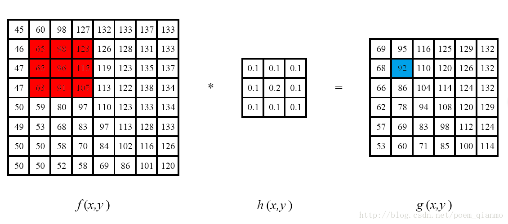
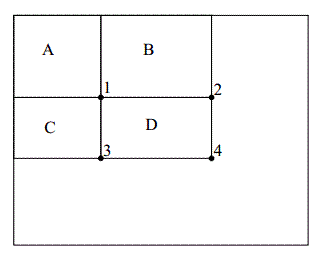
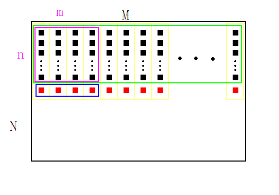
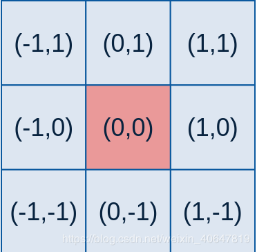
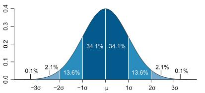

# 图像滤波

图像的实质是一种二维信号，滤波是信号处理中的一个重要概念。在图像处理中，滤波是一种非常常见的技术，它们的原理非常简单，但是其思想却十分值得借鉴，滤波是很多图像算法的前置步骤或基础，掌握图像滤波对理解卷积神经网络也有一定帮助。

## 图像滤波与滤波器

### 平滑处理

“平滑处理“（smoothing）也称“模糊处理”（bluring），是一项简单且使用频率很高的图像处理方法。平滑处理的用途有很多，最常见的是用来减少图像上的噪点或者失真。在涉及到降低图像分辨率时，平滑处理是非常好用的方法。

### 图像滤波与滤波器

图像滤波是在尽量保留图像细节特征的条件下对目标图像的噪声进行抑制，是图像预处理中不可缺少的操作，其处理效果的好坏将直接影响到后续图像处理和分析的有效性和可靠性。消除图像中的噪声成分叫作图像的平滑化或滤波操作。信号或图像的能量大部分集中在幅度谱的低频和中频段是很常见的，而在较高频段，感兴趣的信息经常被噪声淹没。因此一个能降低高频成分幅度的滤波器就能够减弱噪声的影响。

图像滤波的目的有两个：一是抽出对象的特征作为图像识别的特征模式；另一个是为适应图像处理的要求，消除图像数字化时所混入的噪声。而对滤波处理的要求也有两条：一是不能损坏图像的轮廓及边缘等重要信息：二是使图像清晰视觉效果好。

平滑滤波是低频增强的空间域滤波技术。它的目的有两类：一类是模糊；另一类是消除噪音。空间域的平滑滤波一般采用简单平均法进行，就是求邻近像元点的平均亮度值。邻域的大小与平滑的效果直接相关，邻域越大平滑的效果越好，但邻域过大，平滑会使边缘信息损失的越大，从而使输出的图像变得模糊，因此需合理选择邻域的大小。

关于滤波器，一种形象的比喻法是：可以把滤波器想象成一个包含加权系数的窗口，当使用这个滤波器平滑处理图像时，就把这个窗口放到图像之上，透过这个窗口来看得到的图像。

### 滤波与模糊

滤波是将信号中特定波段频率滤除的操作，是抑制和防止干扰的一项重要措施。例如对于高斯滤波而言，是指用高斯函数作为滤波函数的滤波操作。高斯低通就是模糊，高通就是锐化。

## 滤波器介绍

图像滤波既可以在实域进行，也可以在频域进行。图像滤波可以更改或者增强图像。通过滤波，可以强调一些特征或者去除图像中一些不需要的部分。滤波是一个邻域操作算子，利用给定像素周围的像素的值决定此像素的最终的输出值。

邻域算子（局部算子）是利用给定像素周围的像素值的决定此像素的最终输出值的一种算子。而线性邻域滤波是一种常用的邻域算子，像素的输出值取决于输入像素的加权和，具体过程如下图。



邻域算子除了用于局部色调调整以外，还可以用于图像滤波，实现图像的平滑和锐化，图像边缘增强或者图像噪声的去除。本篇文章，我们介绍的主角是线性邻域滤波算子，即用不同的权重去结合一个小邻域内的像素，来得到应有的处理效果。

图像滤波可以通过如下公式计算：
$$
O(i,j)=\sum_{m,n}I(i+m,j+n)\cdot K(m,n)
$$
输出像素值 $O(i,j)$ 是输入像素值 $I(i+m,j+n)$  的加权和。其中K为滤波器，在很多文献中也称之为核（kernel）。常见的应用包括去噪、图像增强、检测边缘、检测角点、模板匹配等。上式可写做 $O=I\otimes K$ 。

滤波可分为两类：

- 线性滤波：对邻域中的像素的计算为线性运算时，如利用窗口函数进行平滑加权求和的运算，或者某种卷积运算，都可以称为线性滤波。常见的线性滤波有：均值滤波、高斯滤波、方框（盒子）滤波、拉普拉斯滤波等等，通常线性滤波器之间只是模版系数不同。
- 非线性滤波：非线性滤波利用原始图像跟模版之间的一种逻辑关系得到结果，如最值滤波器，中值滤波器。比较常用的有中值滤波器和双边滤波器。

 在新版本的OpenCV中，提供了如下五种常用的图像平滑处理操作方法，且他们分别被封装在单独的函数中：

- 方框滤波 — boxblur函数
- 均值滤波（邻域平均滤波）— blur函数
- 高斯滤波 — GaussianBlur函数
- 中值滤波 — medianBlur函数
- 双边滤波 — bilateralFilter函数

### 方框滤波

方框滤波是一种非常有用的线性滤波，也叫盒子滤波，其主要用于在给定的滑动窗口大小下，**对每个窗口内的像素值进行快速相加求和。**均值滤波是盒子滤波归一化的特殊情况。 

**应用：** 用于一切需要求某个邻域内像素之和的场合，比如：均值滤波、引导滤波、计算 Haar 特征等等。

**优势：** 运算速度快，它可以使复杂度为 $O(MN)$ 的求和，求方差等运算降低到 $O(1)$ 或近似于 $O(1)$ 的复杂度，与邻域尺寸无关，类似于积分图且比积分图更快（与它的实现方式有关）。

方框滤波的滤波器如下：
$$
K=\alpha 
\begin{bmatrix}
1 & 1 & 1 & ... & 1 & 1 \\ 1 & 1 & 1 & ... & 1 & 1 \\ &&& .......... \\1 & 1 & 1 & ... & 1 & 1
\end{bmatrix}
$$
其中：
$$
\alpha = 
\begin{cases}
\frac{1}{ksize.width * ksize.height} \quad if \quad normalize = true \\
1 \qquad\qquad\qquad\qquad\ \ if \quad normalize = false 
\end{cases}
$$
方框滤波其归一化后即为均值滤波；不归一化则可以计算每个像素邻域上的各种积分特性，方差、协方差，平方和等等。

在模式识别领域，Haar特征一种常用的图像特征，它可以应用于许多目标检测的算法中。与Haar相似，图像的局部矩形内像素的和、平方和、均值、方差等特征也可以用类似Haar特征的计算方法来计算。这些特征有时会频繁的在某些算法中使用，因此对它的优化势在必行。Boxfilter就是这样一种优化方法，它可以使复杂度为 $O(MN)$ 的求和，求方差等运算降低到 $O(1)$ 或近似于 $O(1)$ 的复杂度，它的缺点是不支持多尺度。

第一个提出Haar特征快速计算方法的是CVPR2001上的那篇经典论文Rapid Object Detection using a Boosted Cascade of Simple Features，它提出了integral image的概念，这个方法使得图像的局部矩形求和运算的复杂度从O(MN)下降到了O(4)。它的原理很简单：首先建立一个数组A，宽高与原图像相等，然后对这个数组赋值，每个元素的值A[i]赋为该点与图像原点所构成的矩形中所有像素的和。初始化之后，想要计算某个矩形像素和的时候可以采用如下方法：如图D矩形的像素和就等于A[4] – A[2] – A[3] + A[1]，共4次运算，即 $O(4)$ 。Integral Image极大的提高了Haar特征的计算速度，它的优点在于能够快速计算任意大小的矩形求和运算。



　Boxfilter的原理有点类似Integral Image，而且比它还要快，但是实现步骤比较复杂。在计算矩形特征之前，Boxfilter与Integral Image都需要对图像进行初始化（即对数组A赋值），不同于Integral Image，Boxfilter的数组A中的每个元素的值是该像素邻域内的像素和（或像素平方和），在需要求某个矩形内像素和的时候，直接访问数组中对应的位置就可以了。因此可以看出它的复杂度是 $O(1)$ 。



Boxfilter的初始化过程如下：

1. 给定一张图像，宽高为 $(M,N)$，确定待求矩形模板的宽高 $(m,n)$ ，如图紫色矩形。图中每个黑色方块代表一个像素，红色方块是假想像素；
2. 开辟一段大小为M的数组，记为buff, 用来存储计算过程的中间变量，用红色方块表示；
3. 将矩形模板（紫色）从左上角 $(0,0)$ 开始，逐像素向右滑动，到达行末时，矩形移动到下一行的开头$(0,1)$，如此反复，每移动到一个新位置时，计算矩形内的像素和，保存在数组A中。以 $(0,0)$ 位置为例进行说明：首先将绿色矩形内的每一列像素求和，结果放在buff内（红色方块），再对蓝色矩形内的像素求和，结果即为紫色特征矩形内的像素和，把它存放到数组A中，如此便完成了第一次求和运算；
4. 每次紫色矩形向右移动时，实际上就是求对应的蓝色矩形的像素和，此时只要把上一次的求和结果减去蓝色矩形内的第一个红色块，再加上它右面的一个红色块，就是当前位置的和了，用公式表示 $sum[i] = sum[i-1] - buff[x-1] + buff[x+m-1]$；
5. 当紫色矩形移动到行末时，需要对buff进行更新。因为整个绿色矩形下移了一个像素，所以对于每个buff[i], 需要加上一个新进来的像素，再减去一个出去的像素，然后便开始新的一行的计算了。

### 均值滤波

均值滤波，是最简单的一种滤波操作，输出图像的每一个像素是核窗口内输入图像对应像素的像素的平均值( 所有像素加权系数相等)，也即归一化后的方框滤波。

应用：根据冈萨雷斯书中的描述，均值模糊可以模糊图像以便得到感兴趣物体的粗略描述，也即去除图像中的不相关细节，其中“不相关”是指与滤波器模板尺寸相比较小的像素区域，从而对图像有一个整体的认知。即为了对感兴趣的物体得到一个大致的整体的描述而模糊一幅图像，忽略细小的细节。

缺陷：均值滤波本身存在着固有的缺陷，即它不能很好地保护图像细节，在图像去噪的同时也破坏了图像的细节部分，从而使图像变得模糊，不能很好地去除噪声点。特别是椒盐噪声。

均值滤波是上述方框滤波的特殊情况，均值滤波方法是：对待处理的当前像素，选择一个模板，该模板为其邻近的若干个像素组成，用模板的均值（方框滤波归一化）来替代原像素的值。公式表示为：
$$
O(x,y) = \frac{1}{n}\sum_{I\in Neighbour} I(x,y)
$$
$O(x,y)$ 为该邻域的中心像素，$n$ 跟系数模版大小有关，一般 $3\times3$ 邻域的模板，$n$ 取为9。实际处理过程中可对图像边界进行扩充，扩充为0或扩充为邻近的像素值。

### 高斯滤波

应用：高斯滤波是一种线性平滑滤波器，对于服从正态分布的噪声有很好的抑制作用。在实际场景中，我们通常会假定图像包含的噪声为高斯白噪声，所以在许多实际应用的预处理部分，都会采用高斯滤波抑制噪声，如传统车牌识别等。

高斯滤波和均值滤波一样，都是利用一个掩膜和图像进行卷积求解。不同之处在于：均值滤波器的模板系数都是相同的为1，而高斯滤波器的模板系数，则随着距离模板中心的增大而系数减小（服从二维高斯分布）。所以，高斯滤波器相比于均值滤波器对图像个模糊程度较小，更能够保持图像的整体细节。

二维高斯分布如下：
$$
f(x,y)=\frac{1}{(\sqrt{2\pi}\sigma)^2}e^{-((x-ux)^2+(y-vy)^2)/2\sigma^2}
$$
由于上式中的系数在计算过程中通常可以忽略而只计算其后部分：
$$ {{}}
f(x,y)=e^{-((x-ux)^2+(y-vy)^2)/2\sigma^2}
$$
其中 $(x,y)$ 为掩膜中的任一点坐标，$(ux,vy)$ 为掩膜内中心点坐标，在图像处理中可认为是整数；$\sigma$ 为标准差。例如，要产生一个3×3的高斯滤波器模板，以模板的中心位置为坐标原点进行取样。模板在各个位置的坐标，如下所示（x轴水平向右，y轴竖直向下）。将各个位置的坐标带入到高斯函数中，得到的值就是模板的系数。



对于窗口模板的大小为 $ (2k+1)×(2k+1)$ ，模板中各个元素值的计算公式如下：
$$
H_{i,j}=\frac{1}{2\pi\sigma^2}e^{-\frac{(i-k-1)^2+(j-k-1)^2}{2\sigma^2}}
$$
这样计算出来的模板有两种形式：小数和整数。

- 小数形式的模板，就是直接计算得到的值，没有经过任何的处理；
- 整数形式的，则需要进行归一化处理，将模板左上角的值归一化为1。使用整数的模板时，需要在模板的前面加一个系数，系数为模板系数和的倒数。

生成高斯掩膜（小数形式）：确定生产掩模的尺寸，然后设定高斯分布的标准差。生成的过程，我们首先根据模板的大小，找到模板的中心位置。 根据高斯分布函数进行遍历，计算模板中每个系数的值。最后模板的每个系数要除以所有系数的和。

$\sigma$ 的意义及选取：标准差代表着数据的离散程度，如果σ较小，那么生成的模板的中心系数较大，而周围的系数较小，这样对图像的平滑效果就不是很明显；反之，σ较大，则生成的模板的各个系数相差就不是很大，比较类似均值模板，对图像的平滑效果比较明显。一维高斯分布的概率分布密度图如下：




## 基于OpenCV的实现

### 函数原型

```c++
/// 方框滤波
void boxFilter( InputArray src, OutputArray dst, 
                int ddepth,
                Size ksize,  
                Point anchor = Point(-1,-1),
                bool normalize = true,
                int borderType = BORDER_DEFAULT );
/**
Parameters:
	src : 输入图像;
	dst : 目标图像;
	ddepth : 输出图像的深度，-1代表使用原图深度;
	ksize : 内核大小，Size(w,h)表示内核的大小(其中，w为像素宽度，h为像素高度)。
	anchor : 表示锚点（即被平滑的那个点），默认值Point(-1,-1)表示锚点在核的中心。
	normalize : 默认值为true，一个标识符，表示内核是否被其区域归一化。
	borderType : 用于推断图像外部像素的某种边界模式。默认值BORDER_DEFAULT，通常无需考虑。
**/

// 均值滤波
void blur(InputArray 	src,
          OutputArray 	dst,
          Size 			ksize,
          Point 		anchor = Point(-1,-1),
          int 	  		borderType = BORDER_DEFAULT );
/**
Parameters:
	src : 输入图像;
	dst : 目标图像;
	ksize : 内核大小，Size(w,h)表示内核的大小(其中，w为像素宽度，h为像素高度)。
	normalize : 默认值为true，一个标识符，表示内核是否被其区域归一化。
	borderType : 用于推断图像外部像素的某种边界模式。默认值BORDER_DEFAULT，通常无需考虑。
**/

// 高斯滤波
void GaussianBlur(InputArray src, OutputArray dst, 
                  Size ksize, 
                  double sigmaX, double sigmaY=0,
                  int borderType=BORDER_DEFAULT );

/**
Parameters:
	src : 输入图像;
	dst : 目标图像;
	ksize : 内核大小，Size(w,h)表示内核的大小(其中，w为像素宽度，h为像素高度)。
	sigmaX : 表示高斯核函数在X方向的的标准偏差。
	sigmaY : 表示高斯核函数在Y方向的的标准偏差。若sigmaY为零，就将它设为sigmaX，如果sigmaX和sigmaY都是0，那么就由ksize.width和ksize.height计算出来。
	borderType : 用于推断图像外部像素的某种边界模式。默认值BORDER_DEFAULT，通常无需考虑。
**/
```

### 代码实现

```c++
#include <opencv2/core/core.hpp>
#include <opencv2/highgui/highgui.hpp>
#include <opencv2/imgproc/imgproc.hpp>
#include <string>

using namespace std;
using namespace cv;

string lena = "../image/lena.jpg";

void filterTest()
{
    //载入图像
    Mat image = imread(lena);
    Mat dst1, dst2, dst3;
    //均值滤波
    blur(image, dst1, Size(7, 7));
    //方框滤波
    boxFilter(image, dst2, -1, Size(7, 7), Point(-1, -1), true, BORDER_CONSTANT);
    //高斯滤波
    GaussianBlur(image, dst3, Size(7, 7), 0.8);

    //创建窗口并显示
    namedWindow("均值滤波效果图");
    namedWindow("方框滤波效果图");
    namedWindow("高斯滤波效果图");
    imshow("均值滤波效果图", dst1);
    imshow("方框滤波效果图", dst2);
    imshow("高斯滤波效果图", dst3);
    waitKey(0);
}

int main()
{
    filterTest();
    return 0;
}
```

## C++实现


# 参考文章

1. https://blog.csdn.net/weixin_40647819/article/details/105467935
2. https://blog.csdn.net/qq_37469992/article/details/78023835
3. https://blog.csdn.net/qq_15606489/article/details/52755444
4. https://www.cnblogs.com/lwl2015/p/4460711.html
