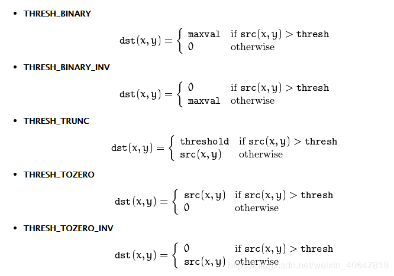

# 图像分割/二值化

图像阈值化分割是一种传统的最常用的图像分割方法，因其实现简单、计算量小、性能较稳定而成为图像分割中最基本和应用最广泛的分割技术。它特别适用于目标和背景占据不同灰度级范围的图像。它不仅可以极大的压缩数据量，而且也大大简化了分析和处理步骤，因此在很多情况下，是进行图像分析、特征提取与模式识别之前的必要的图像预处理过程。图像阈值化的目的是要按照灰度级，对像素集合进行一个划分，得到的每个子集形成一个与现实景物相对应的区域，各个区域内部具有一致的属性，而相邻区域不具有这种一致属性。这样的划分可以通过从灰度级出发选取一个或多个阈值来实现。

## 图像分割算法

### 最大类间方差法（大津阈值法）

大津法（OTSU）是一种确定图像二值化分割阈值的算法，由日本学者大津于1979年提出。从大津法的原理上来讲，该方法又称作最大类间方差法，因为按照大津法求得的阈值进行图像二值化分割后，前景与背景图像的类间方差最大。

它被认为是图像分割中阈值选取的最佳算法，计算简单，不受图像亮度和对比度的影响，因此在数字图像处理上得到了广泛的应用。它是按图像的灰度特性，将图像分成背景和前景两部分。因方差是灰度分布均匀性的一种度量,背景和前景之间的类间方差越大，说明构成图像的两部分的差别越大,当部分前景错分为背景或部分背景错分为前景都会导致两部分差别变小。因此，使类间方差最大的分割意味着错分概率最小。

**应用：** 是求图像全局阈值的最佳方法，适用于大部分需要求图像全局阈值的场合。

**优点：** 计算简单快速，不受图像亮度和对比度的影响。

**缺点：** 对图像噪声敏感；只能针对单一目标分割；当目标和背景大小比例悬殊、类间方差函数可能呈现双峰或者多峰，这个时候效果不好。

#### 类间方差的求解

算法假设图像像素能够根据阈值被分成背景和前景两部分。然后计算该最佳阈值来区分这两类像素，使得两类像素区分度最大。从像素分布直方图的角度来看就是在像素分布直方图的峰值之间找一个点，使得两个类之间的方差最大。设 $I$ 代表灰度级数，第 $i$ 个灰度级的像素个数为 $n_i$ 。则灰度直方图的概率分布为：
$$
p_i=\frac{n_i}{N}, \qquad p_i\ge 0,\ \sum_{i=1}^I p_i=1
$$
假设图像被灰度阈值 $k$ 分成 $C_1, C_2$ 两类（前景和背景）。则某个灰度在两类之间出现的分别概率为：
$$
w_0=Pr(C_0)=\sum_{i=1}^k p_i=w(k) \\
w_1=Pr(C_1)=\sum_{i=k+1}^I p_i=1-w(k)
$$
则两类的灰度平均值分别为：
$$
\mu_0=\sum_{i=1}^k i*Pr(i|C_0)=\sum_{i=1}^k i*p_i/w_0=\frac{\mu(k)}{w(k)} \\
\mu_1=\sum_{i=k+1}^I i*Pr(i|C_1)=\sum_{i=k+1}^I i*p_i/w_1=\frac{\mu_T-\mu(k)}{1-w(k)} 
$$
其中
$$
w(k)=\sum_{i=1}^k p_i，\ \mu(k)=\sum_{i=1}^k i*p_i，\ \mu_T=\mu(I)=\sum_{i=1}^L i*p_i
$$
$\mu_T$ 表示全局平均值。由此可知有：
$$
w_0\mu_0+w_1\mu_1=\mu_T, \quad w_0+w_1=1
$$
则方差分别为：
$$
\sigma_0^2=\sum_{i=1}^k (i-\mu_0)^2 Pr(i|C_0)=\sum_{i=1}^k (i-\mu_0)^2 p_i/w_0 \\
\sigma_1^2=\sum_{i=k+1}^I (i-\mu_1)^2 Pr(i|C_1)=\sum_{i=k+1}^I (i-\mu_1)^2 p_i/w_1
$$ {2}
则类内方差 $\sigma_W^2$ 、类间方差 $\sigma_B^2$ 为：
$$
\sigma_W^2=w_0\sigma_0^2+w_1\sigma_1^2 \\
\sigma_B^2=w_0(\mu_0-\mu_T)^2+w_1(\mu_1-\mu_T)^2 = w_0w_1(\mu_1-\mu_0)^2
$$
总体方差 $\sigma_T^2$ 为：
$$
\sigma_T^2=\sum_{i=1}^I (i-\mu_T)^2p_i=\sigma_W^2+\sigma_B^2
$$
通过代入化简，最终可得类间方差计算公式：
$$
\sigma_B^2(k)=\frac{[\mu_T*w(k)-\mu(k)]^2}{w(k)[1-w(k)]}
$$
则最优阈值 $k^*$ 可通过下式求解：
$$
\sigma_B^2(k^*)=\max_{1\le k \le I} \sigma_B^2(k)
$$
通过遍历所有灰度级 $I$ ，求能使得上式最大化的灰度级 $k$ 就是OTSU阈值。

#### 分割

此处分割即二值化，OpenCV给了以下几种方式：



### 自适应阈值

OTSU算法属于全局阈值法，对于某些光照不均的图像，该方法则无能为力。此时需要使用自适应阈值法(adaptiveThreshold)。该方法的思想不是计算全局图像的阈值，而是根据图像不同区域亮度分布，计算其局部阈值，所以对于图像不同区域，能够自适应计算不同的阈值，因此被称为自适应阈值法(其实就是局部阈值法)。局部阈值的确定可以计算某个邻域(局部)的均值、中值、高斯加权平均(高斯滤波)来确定阈值。值得说明的是：如果用局部的均值作为局部的阈值，就是常说的移动平均法。

## 基于OpenCV的实现

### 函数原型

#### 最大类间方差法

```c++
double cv::threshold	(InputArray 	src,
                         OutputArray 	dst,
                         double 		thresh,
                         double 		maxval,
                         int      		type 
)
    
/**
Parameters:
	src : 源图像
	dst : 目标图像
	thresh : 分割阈值
	maxval : 使用THRESH_BINARY和THRESH_BINARY_INV阈值类型时的最大值
	type : 阈值类型
**/
```

#### 自适应阈值

```C++
void adaptiveThreshold( InputArray 	src, 
						OutputArray dst, 
                        double 		maxValue,
                        int 		adaptiveMethod,
                        int 		thresholdType, 
                        int 		blockSize, 
                        double 		C)
/**
Parameters:
	src : 源图像
	dst : 目标图像
	maxValue : 分配给满足条件的像素的非零值
	adaptiveMethod : 在一个邻域内计算阈值所采用的算法，取值为ADAPTIVE_THRESH_MEAN_C或ADAPTIVE_THRESH_GAUSSIAN_C 。
		ADAPTIVE_THRESH_MEAN_C的计算方法是计算出领域的平均值再减去第七个参数double C的值。
		ADAPTIVE_THRESH_GAUSSIAN_C的计算方法是计算出领域的高斯均值再减去第七个参数double C的值。
	thresholdType：阈值类型，取值为 THRESH_BINARY 和THRESH_BINARY_INV。
	blockSize：adaptiveThreshold的计算单位是像素的邻域块，这是局部邻域大小，3、5、7等。
	C：偏移值调整量，用均值和高斯计算阈值后，再减或加这个值就是最终阈值。
	
**/
```

代码实现：

```c++
#include <opencv2/core/core.hpp>
#include <opencv2/highgui/highgui.hpp>
#include <opencv2/imgproc/imgproc.hpp>

using namespace cv;
using namespace std;

extern string lena;

void otsuTest()
{
    Mat src = imread(lena), gray, dst;
    CV_Assert(!src.empty());
    cvtColor(src, gray, COLOR_BGR2GRAY);

    threshold(gray, dst, 0, 255, THRESH_OTSU);

    imshow("src", src);
    imshow("gray", gray);
    imshow("dst", dst);
    waitKey(0);
}

void adaptiveThresholdTest()
{
    Mat src = imread(lena), gray, dst;
    CV_Assert(!src.empty());
    cvtColor(src, gray, COLOR_BGR2GRAY);

    cv::adaptiveThreshold(gray, dst, 255, ADAPTIVE_THRESH_MEAN_C, THRESH_BINARY, 21, 10);

    imshow("src", src);
    imshow("gray", gray);
    imshow("dst", dst);
    waitKey(0);
}
```


## 参考文章

1. https://blog.csdn.net/weixin_40647819/article/details/90179953
2. https://blog.csdn.net/weixin_40647819/article/details/90213858
3. N. Otsu, “A threshold selection method from gray-level histograms,” IEEE Transactions on Systems, Man, and Cybernetics, vol. 9, no. 1, pp. 62–66, 1979.

