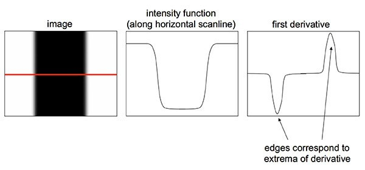

# 边缘检测

边缘是图像强度函数快速变化的地方。为了检测边缘，我们需要检测图像中的**不连续性**，可以使用**导数**来检测不连续性。



如上图所示，上图的第一幅图表示一张数字图片，我们对水平红线处进行求导，便可得到上图二中的关系，可以看到在边缘处有着较大的跳变。但是，导数也会受到噪声的影响，因此建议在求导数之前先对图像进行平滑处理（上图三）。然后可以使用卷积来检测边缘。 

## Sobel算子

 Sobel 算子是一个主要用作边缘检测的离散微分算子。Sobel算子结合了高斯平滑和微分求导，用来计算图像灰度函数的近似梯度。在图像的任何一点使用此算子，将会产生对应的梯度矢量或是其法矢量。

该算子包含两组 $3\times 3$ 的矩阵，分别为横向及纵向，将之与图像作平面卷积，即可分别得出横向及纵向的亮度差分近似值。如果以 $I$ 代表原始图像，$Gx$ 及 $Gy$ 分别代表经横向及纵向边缘检测的图像灰度值，其公式如下：
$$
G_x=\begin{bmatrix}
-1 & 0 & +1 \\ -2 & 0 & +2 \\-1 & 0 & +1
\end{bmatrix} * I ,\quad G_y = \begin{bmatrix}
+1 & +2 & +1 \\ 0 & 0 & 0 \\ -1 & -2 & -1
\end{bmatrix} * I
$$


在图像的每一点，结合以上两个结果求出近似梯度：
$$
G=\sqrt{G_x^2+G_y^2}
$$
另外有时，也可用下面更简单公式代替：
$$
G=|G_x|+|G_y|
$$
如果梯度 $G$ 大于某一阀值，则认为该点 $(x,y)$ 为边缘点。同时可用以下公式计算梯度方向：
$$
\theta=\arctan\left(\frac{G_y}{G_x}\right)
$$
Sobel算子根据像素点上下、左右邻点灰度加权差，在边缘处达到极值这一现象检测边缘。对噪声具有平滑作用，提供较为精确的边缘方向信息，边缘定位精度不够高。当对精度要求不是很高时，是一种较为常用的边缘检测方法。

## Canny边缘检测

### canny算子简介

Canny边缘检测算子是John F.Canny于 1986 年开发出来的一个多级边缘检测算法。更为重要的是 Canny 创立了边缘检测计算理论（Computational theory ofedge detection），解释了这项技术是如何工作的。 Canny边缘检测算法以Canny的名字命名，被很多人推崇为当今最优的边缘检测的算法。

其中，Canny 的目标是找到一个最优的边缘检测算法，让我们看一下最优边缘检测的三个主要评价标准：

1.低错误率: 标识出尽可能多的实际边缘，同时尽可能的减少噪声产生的误报。

2.高定位性: 标识出的边缘要与图像中的实际边缘尽可能接近。

3.最小响应: 图像中的边缘只能标识一次，并且可能存在的图像噪声不应标识为边缘。

为了满足这些要求 Canny 使用了变分法，这是一种寻找满足特定功能的函数的方法。最优检测使用四个指数函数项的和表示，但是它非常近似于高斯函数的一阶导数。

###  Canny 边缘检测的步骤

1. 消除噪声。 一般情况下，使用高斯平滑滤波器卷积降噪。 如下显示了一个 size = 5 的高斯内核示例：
   $$
   K=\frac{1}{139}\begin{bmatrix}
   2 & 4 & 5 & 4 & 2 \\ 4 & 9 & 12 & 9 & 4 \\ 5 & 12 & 15 & 12 & 5 \\ 
   4 & 9 & 12 & 9 & 4 \\ 2 & 4 & 5 & 4 & 2
   \end{bmatrix}
   $$
   

2. 计算梯度幅值和方向。 此处，按照Sobel滤波器的步骤。运用一对卷积阵列 (分别作用于 $x$ 和 $y$ 方向)：
   $$
   G_x=\begin{bmatrix}
   -1 & 0 & +1 \\ -2 & 0 & +2 \\-1 & 0 & +1
   \end{bmatrix},\quad G_y = \begin{bmatrix}
   +1 & +2 & +1 \\ 0 & 0 & 0 \\ -1 & -2 & -1
   \end{bmatrix}
   $$
   使用下列公式计算梯度幅值和方向：
   $$
   G=\sqrt{G_x^2+G_y^2}, \quad \theta=\arctan\left(\frac{G_y}{G_x}\right)
   $$
   梯度方向近似到四个可能角度之一(一般为0, 45, 90, 135)。

3. 非极大值抑制。在每一点上，邻域中心与沿着其对应的梯度方向的两个像素相比，若中心像素为最大值，则保留，否则中心置0，这样可以抑制非极大值，保留局部梯度最大的点，以得到细化的边缘。

   对图像进行梯度计算后，仅仅基于梯度值提取的边缘仍然很模糊。对边缘有且应当只有一个准确的响应。而非极大值抑制则可以帮助将局部最大值之外的所有梯度值抑制为0。非极大值抑制是一种边缘稀疏技术，非极大值抑制的作用在于“瘦”边。直观上地看，对第二步得到的图片，边缘由粗变细了。

4. 用双阈值算法检测和连接边缘。

   

假设两类边缘：经过非极大值抑制之后的边缘点中，**梯度值超过TH的称为强边缘，梯度值小于TH大于TL的称为弱边缘，梯度小于TL的不是边缘**。

可以肯定的是，强边缘必然是边缘点，因此必须将T1设置的足够高，以要求像素点的梯度值足够大（变化足够剧烈），而弱边缘可能是边缘，也可能是噪声。当弱边缘的周围8邻域有强边缘点存在时，就将该弱边缘点变成强边缘点，以此来实现对强边缘的补充。实际中人们发现T1:T2=2:1的比例效果比较好，其中T1可以人为指定，也可以设计算法来自适应的指定，比如定义梯度直方图的前30%的分界线为T1。检查8邻域的方法叫边缘滞后跟踪，连接边缘的办法还有区域生长法等等。

## 基于OpenCV的实现

### 函数原型

```c++
void Sobel (InputArray 	src,
 			OutputArray dst,
			int 		ddepth,
 			int 		dx,
 			int 		dy,
 			int			ksize=3,
 			double 		scale=1,
 			double 		delta=0,
 			int 		borderType=BORDER_DEFAULT );
/**
Parameters:
	src : 输入图像
	dst : 目标图像
	ddepth : 输出图像的深度
	dx,dy : x,y方向上的差分阶数。
	ksize : 有默认值3，表示Sobel核的大小;必须取1，3，5或7。
	scale : 计算导数值时可选的缩放因子，默认值是1，表示默认情况下是没有应用缩放的。
	delta : 表示在结果存入目标图（第二个参数dst）之前可选的delta值，有默认值0。
	borderType : ，边界模式，默认值为BORDER_DEFAULT。
	
一般情况下，都是用ksize x ksize内核来计算导数的。然而，有一种特殊情况——当ksize为1时，往往会使用3 x 1或者1 x 3的内核。且这种情况下，并没有进行高斯平滑操作。
**/

void Canny(InputArray 	image,
           OutputArray 	edges, 
           double 		threshold1, 
           double 		threshold2, 
           int 			apertureSize=3,
           bool 		L2gradient=false)
/**
Parameters:
	image : 输入图像。
	edges : 输出的边缘图，需要和源图片有一样的尺寸和类型。
	threshold1,threshold2 : 第一个和第二个滞后性阈值。
	apertureSize : 表示应用Sobel算子的孔径大小，其有默认值3。
	L2gradient : 一个计算图像梯度幅值的标识，有默认值false。
	
需要注意的是，这个函数阈值1和阈值2两者的小者用于边缘连接，而大者用来控制强边缘的初始段， 推荐的高低阈值比在2:1到3:1之间。
**/
```

一些补充说明：

1. 当内核大小为 3 时, 我们的Sobel内核可能产生比较明显的误差(毕竟，Sobel算子只是求取了导数的近似值而已)。 为解决这一问题，OpenCV提供了Scharr 函数，但该函数仅作用于大小为3的内核。该函数的运算与Sobel函数一样快，但结果却更加精确，其内核是这样的:

   

代码实现：

```C++
#include <opencv2/core/core.hpp>
#include <opencv2/highgui/highgui.hpp>
#include <opencv2/imgproc/imgproc.hpp>

using namespace cv;
using namespace std;

std::string lena = "../image/lena.jpg";

void sobelTest()
{
    Mat src = imread(lena), sobelx, sobely;

    Sobel(src, sobelx, CV_64F, 1, 0, 5);
    Sobel(src, sobely, CV_64F, 0, 1, 5);

    imshow("src", src);
    imshow("sobelx", sobelx);
    imshow("sobely", sobely);
    waitKey();
}

void cannyTest()
{
    Mat src = imread(lena), gauss_img, canny_img;

    GaussianBlur(src, gauss_img, Size(3,3), 0);
    Canny(gauss_img, canny_img, 50, 150);

    imshow("src", src);
    imshow("canny", canny_img);
    waitKey();
}

int main()
{
//    sobelTest();
    cannyTest();
    return 0;
}
```


## 参考文章

1. https://www.tuicool.com/articles/Y3q2Mf
2. [https://github.com/datawhalechina/team-learning/blob/master/%E8%AE%A1%E7%AE%97%E6%9C%BA%E8%A7%86%E8%A7%89%E5%9F%BA%E7%A1%80%EF%BC%9A%E5%9B%BE%E5%83%8F%E5%A4%84%E7%90%86%EF%BC%88%E4%B8%8A%EF%BC%89/Task06%20%E8%BE%B9%E7%BC%98%E6%A3%80%E6%B5%8B.md](https://github.com/datawhalechina/team-learning/blob/master/计算机视觉基础：图像处理（上）/Task06 边缘检测.md)

